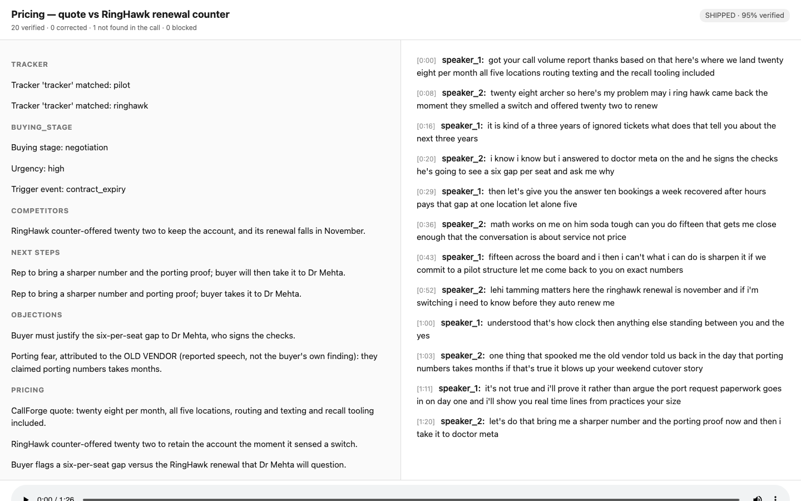

# OpenGong Lite

**Open-source call notes where every claim links to the transcript line it came from.**
Not "asked the AI to cite" — verified in code: a claim whose quote can't be re-anchored
into the stored transcript is visibly demoted, never silently shipped.


*What you're looking at: a real call, four claim states. Green claims re-anchored exactly.
The grey one is a planted fake — the system refuses to pretend it's true. The red one is a
prompt injection spoken inside the call, caught, struck through, and barred from notes and
email. The badge at the top says "67% verified" because honesty is the product.*

## Try it (no keys, no signup, ~2 minutes)

```bash
git clone <repo-url> && cd opengong-lite
npm start      # mints its own free PyAI sandbox key, verifies the pipeline
npm run demo   # opens the receipts viewer on a bundled call — works offline
npm test       # 238 tests, all offline
```

Upload your own call: `node src/ingest.js your-call.wav` (dual-channel/stereo recordings —
the standard telephony export format — get exact per-speaker labels; mono works with
inferred roles, honestly labeled as inferred).

## Why receipts

Every AI notetaker summarizes. None of them can prove a line. We checked the code:

| Tool | The receipts story |
|---|---|
| **anarlog / Hyprnote** (9K★) | Citation is architecturally impossible in its summary path — only `{text, speaker}` ever reaches the model (no ids, no timestamps). They built a working evidence-ID citation engine… and pointed it at speaker labeling. |
| **Meetily** (29K★) | Diarization is paywalled out of the open-source edition; the audio behind a summary isn't replayable from the notes view. |
| **playcall** | Plaintext transcript ingestion — no audio pipeline to anchor into. |
| **Gong** | Call briefs don't carry claim-level citations (their Q&A assistant does).* |
| **OpenGong Lite** | Model returns a verbatim quote; **code** locates it: exact → normalized (never digit-folding — a wrong number can't be laundered in) → unique-rescue → **visibly demoted**. Ties resolve to null, never a guess. |

<sub>*Written comparison from product documentation; screenshot verification pending.
Every other row is verified against the named project's source code — receipts in
`research/11-competitive-intel/`.</sub>

## What it does

Audio in → PyAI batch transcription (channel-based diarization) → canonical transcript →
seven extractor families (summary, next steps, objections, pain, pricing, competitors,
plus a zero-LLM keyword tracker) → **the receipts gate** → notes where clicking any claim
highlights its exact line and plays that second of audio → self-contained HTML share file
→ follow-up email drafted **only from verified claims** (a draft citing anything
unverified is rejected whole — that's the injection choke point).

Adding an extraction family is **one JSON file, zero code** — declared against a schema,
validated at startup, portable across LLM providers (extractors declare a role, never
a model).



*A real call through the real pipeline: synthesized stereo audio, transcribed back,
extracted, gated. 20 claims verified at 95%. Note the objection correctly attributed to
the OLD VENDOR as reported speech, and the tracker rows that cost zero tokens.*

## Honest architecture

Self-hosted app + hosted inference: audio goes to PyAI (speech), extraction goes to
Anthropic (LLM) — named plainly, enumerated per network call in `DATA-FLOW.md`. Your
data is files on your disk: JSON is the source of truth, SQLite is a rebuildable index,
share links carry claims + cited lines only. The demo path spends zero keys; a free
sandbox key self-mints for live runs.

## Known limitations (on purpose, stated plainly)

- **Hyphen/slash quotes can demote honestly-cited claims.** The transcript is
  unpunctuated ("follow up"); a model quoting "follow-up" fails exact match and may land
  in the unverified bucket. We prefer a false demotion to a loosened matcher — digit
  folding stays refused so a wrong number can never be laundered in.
- **The injection taint screen is best-effort.** Deterministic pattern screening; novel
  phrasings can slip past it. The system doesn't rely on it alone: escaping in every view
  and the email choke point contain what the screen misses.
- **Cross-utterance cues aren't modeled.** Sarcasm or hypotheticals spanning turns can
  produce a technically-verified quote with a misleading reading; receipts render with
  surrounding turns visible to mitigate, not solve.
- **"Right quote, wrong claim" is unsolved** — the gate proves the line was said, not
  that it means what the claim says. The interpretation layer badges, never blocks.
- **The email composer trusts the gate.** Its guarantee is downstream of gate integrity,
  not independent of it.
- **English-only transcription today** (provider constraint).

## Roadmap (named, not promised)

- **Connect your CRM, pick a recording** — the read side of CRM integration. Ingestion
  today is upload + URL. We researched the real call/next-step field names across
  HubSpot, Salesforce, and JustCall, and each extractor declares its target field — so
  CRM-connect is two adapters (read a recording's ids from the CRM when you pick it;
  write our fields back via the declared mapping), additive config on the receipts core.
- **CRM write-back** — the declared `crm_map` mappings in the other direction
  (`ai_next_action` and friends), approval-gated, append-never-replace.
- **Live capture** — the ingest input is shaped to accept a Vexa-style
  `meeting.completed` webhook payload unchanged.
- **Extractor sharing** — extraction families are single JSON files; a community
  registry is the obvious next step.

## You'll hate this if…

You want sentiment scores (uncitable, so we don't ship them), real-time in-call coaching
(we're batch post-call, like the incumbents actually are), or a meeting bot that joins
your calls (we work on recordings you already have).

## For the team (internal)

Contributors and their agents: start at `START-HERE.md` — reading order, live state
(`team/SYNC.md`), and the taskboard. MIT licensed. Built at the SaaS Labs PyAI hackathon.
